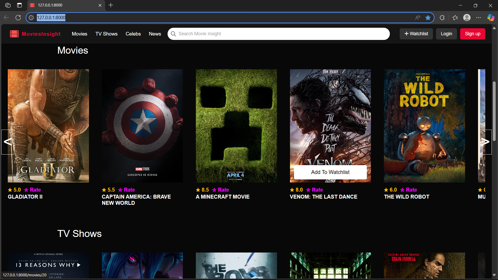
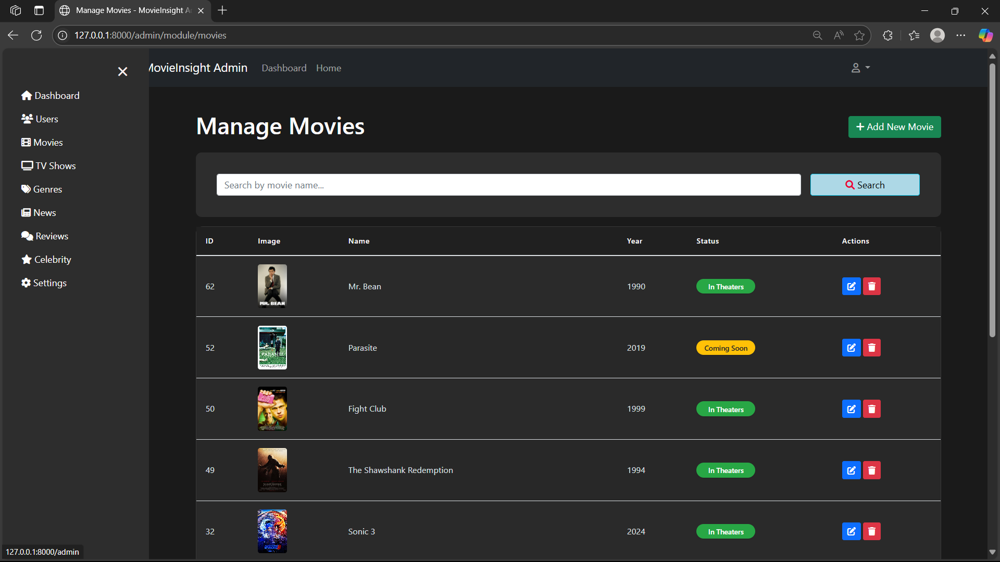

# 🎬 Movie-Insight
Discover, explore, and gain deep insights into your favorite films with ease.

   





## ✨ Features

*   🔍 **Extensive Movie Database**: Seamlessly browse and search through a vast collection of movies, complete with detailed information.
*   💬 **User Reviews & Comments**: Share opinions, write reviews, and engage in discussions with other movie enthusiasts through interactive comment sections.
*   📊 **In-depth Insights**: Access comprehensive data including cast, crew, genres, ratings, and plot summaries for every film.
*   ⚡ **Blazing Fast Search**: Quickly find any movie using intelligent search capabilities across titles and keywords.
*   📱 **Responsive Design**: Enjoy a consistent and user-friendly experience across all devices, from desktop to mobile, thanks to a fluid layout.
*   🛠️ **Modular Architecture**: Built with a clean, maintainable modular structure using Laravel, enhancing extensibility and future development.

## 🚀 Installation

Follow these step-by-step instructions to get Movie-Insight up and running on your local machine.

### Prerequisites

Before you begin, ensure you have the following software installed on your system:

*   **PHP** >= 8.1
*   **Composer**
*   **Node.js** & **npm** (or Yarn)
*   A **database** (e.g., MySQL, PostgreSQL, SQLite)

### Step-by-Step Setup

1.  **Clone the repository:**

    ```bash
    git clone https://github.com/Duwong31/Movie-Insight.git
    cd Movie-Insight
    ```

2.  **Install PHP Dependencies:**

    Use Composer to install all server-side dependencies:

    ```bash
    composer install
    ```

3.  **Install Node.js Dependencies:**

    Install frontend dependencies using npm or Yarn:

    ```bash
    npm install
    # OR if you prefer Yarn
    # yarn install
    ```

4.  **Environment Configuration:**

    Copy the example environment file and generate a unique application key:

    ```bash
    cp .env.example .env
    php artisan key:generate
    ```

    Open the newly created `.env` file and configure your database connection settings (e.g., `DB_DATABASE`, `DB_USERNAME`, `DB_PASSWORD`) and any other necessary environment variables.

    ```ini
    APP_NAME="Movie Insight"
    APP_ENV=local
    APP_KEY=base64:YOUR_GENERATED_KEY_HERE
    APP_DEBUG=true
    APP_URL=http://localhost

    LOG_CHANNEL=stack
    LOG_LEVEL=debug

    DB_CONNECTION=mysql
    DB_HOST=127.0.0.1
    DB_PORT=3306
    DB_DATABASE=movie_insight
    DB_USERNAME=root
    DB_PASSWORD=
    ```

5.  **Database Migration:**

    Run the database migrations to set up your database schema:

    ```bash
    php artisan migrate
    ```

6.  **Compile Assets:**

    Build the frontend assets using Vite:

    ```bash
    npm run dev
    # OR for a production-ready build
    # npm run build
    ```

7.  **Serve the Application:**

    Start the local development server:

    ```bash
    